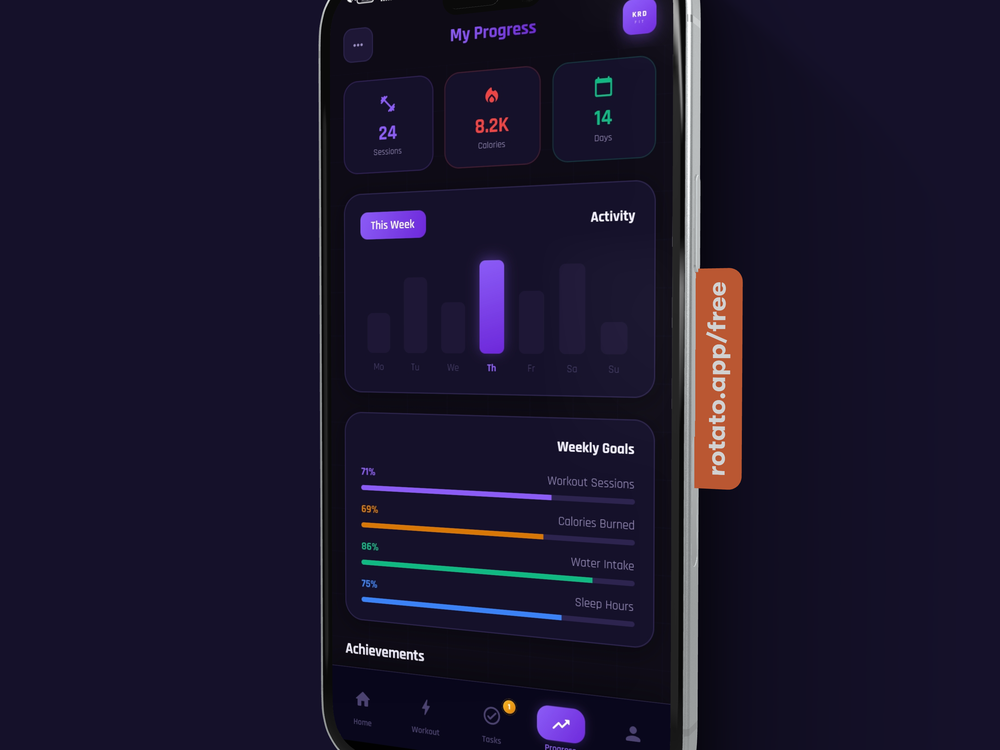
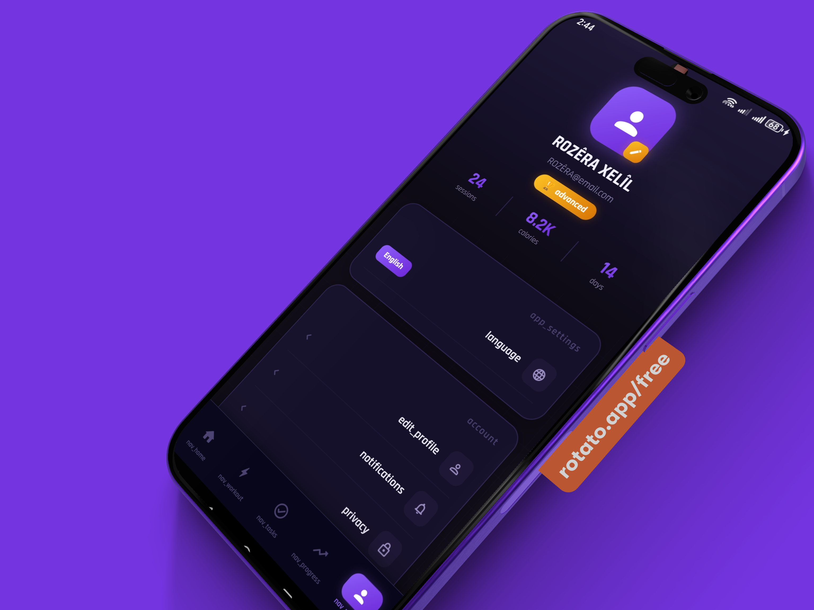
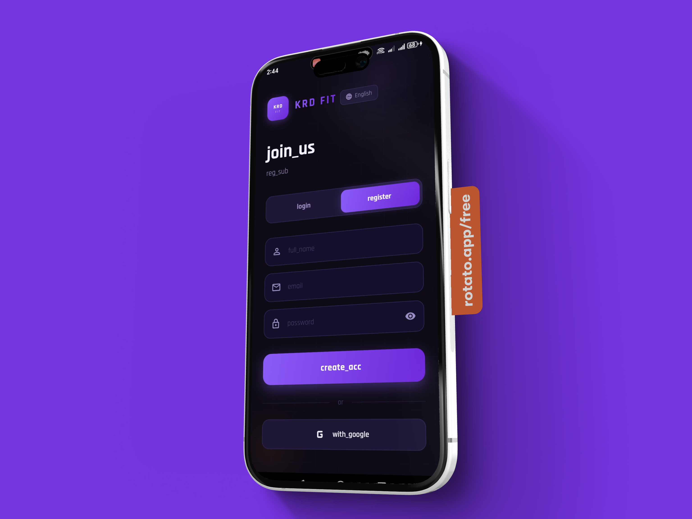
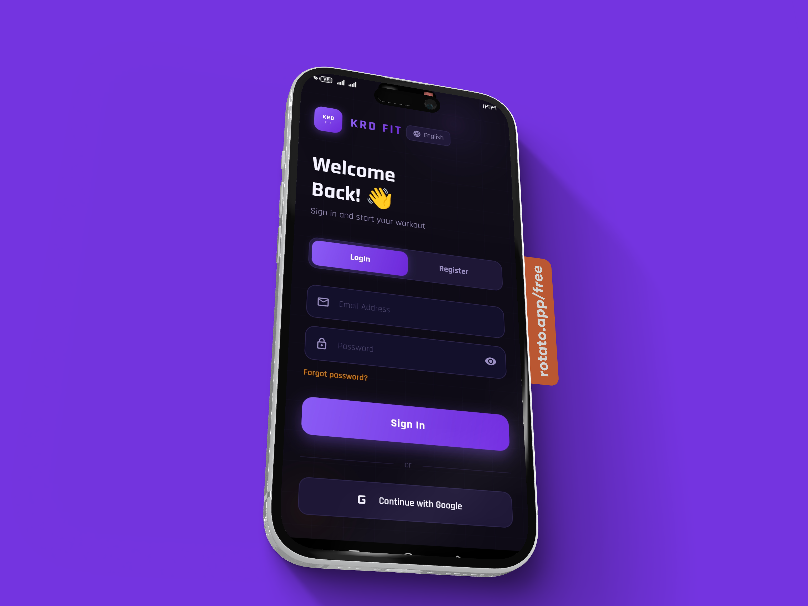
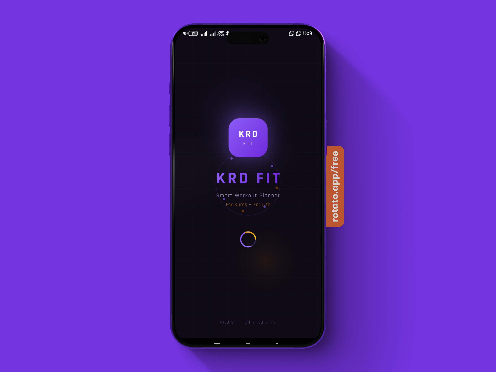
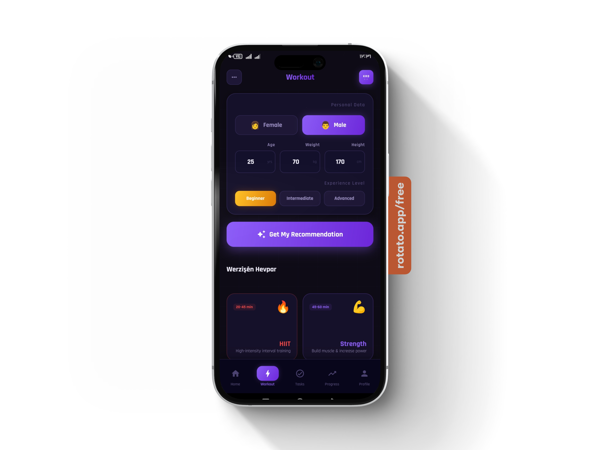
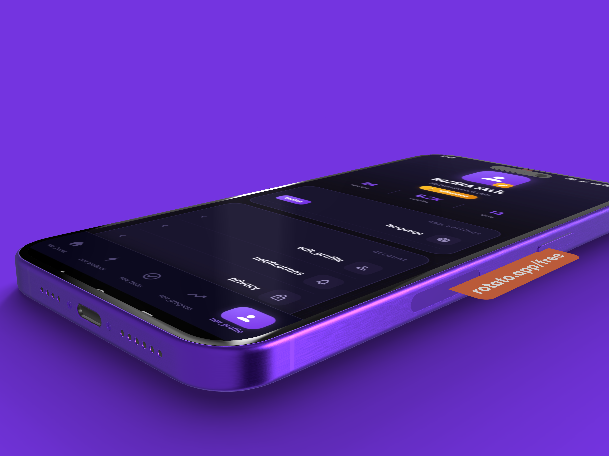

# 💪 KRD FIT – Smart Fitness Coach

## 🌍 Overview

KRD FIT is a modern smart fitness application designed for users, combining elegant UI, intelligent recommendations, and a smooth animated experience.

The app focuses on delivering personalized workout plans, tracking progress, and motivating users through a clean and engaging interface.

---

## ✨ Key Features

* 🤖 AI-powered workout recommendations
* 🌐 Multi-language support (Arabic, Kurdish, English, French)
* 📊 Progress tracking with visual insights
* 🔔 Smart notifications and reminders
* 🎨 Modern UI with smooth animations
* 🧠 Personalized fitness plans based on user data

---

## 🎨 UI Preview

All screens are displayed in order to reflect the full app flow:

---

## 🚀 Future Goals

* Advanced AI recommendations
* Wearable device integration
* Social fitness community

---

## 👨‍💻 About the Author

# ROZÊRA-XELÎL full_stack dev &&& AI_eng Student

<picture>
  <source media="(prefers-color-scheme: dark)" srcset="https://readme-typing-svg.demolab.com?font=Press+Start+2P&size=50&duration=3000&pause=500&color=FFD700&center=true&vCenter=true&width=800&lines=2+%2B+2+%3D+1">
  <source media="(prefers-color-scheme: light)" srcset="https://readme-typing-svg.demolab.com?font=Press+Start+2P&size=50&duration=3000&pause=500&color=D32F2F&center=true&vCenter=true&width=800&lines=2+%2B+2+%3D+1">
  
</picture>

  <i>“Building intelligent solutions with minimal footprint.”</i>

---
